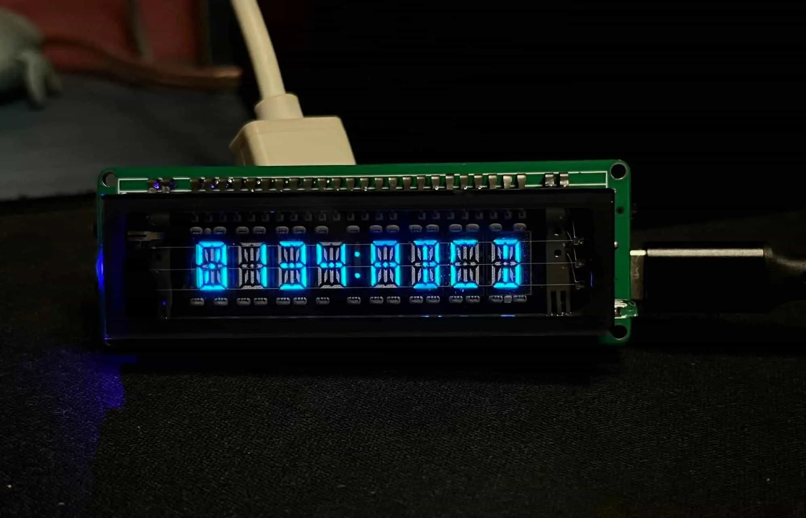
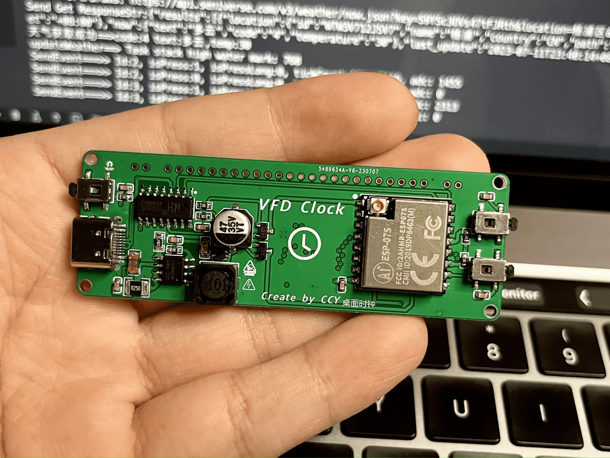
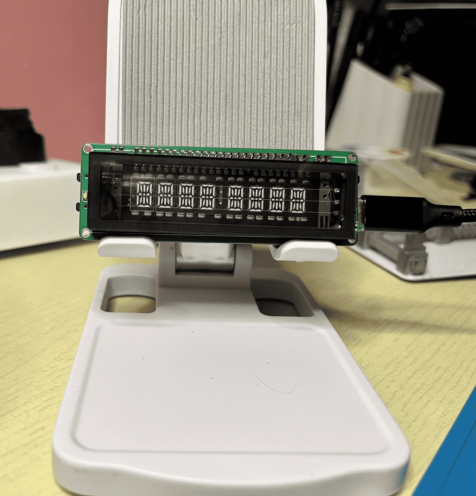
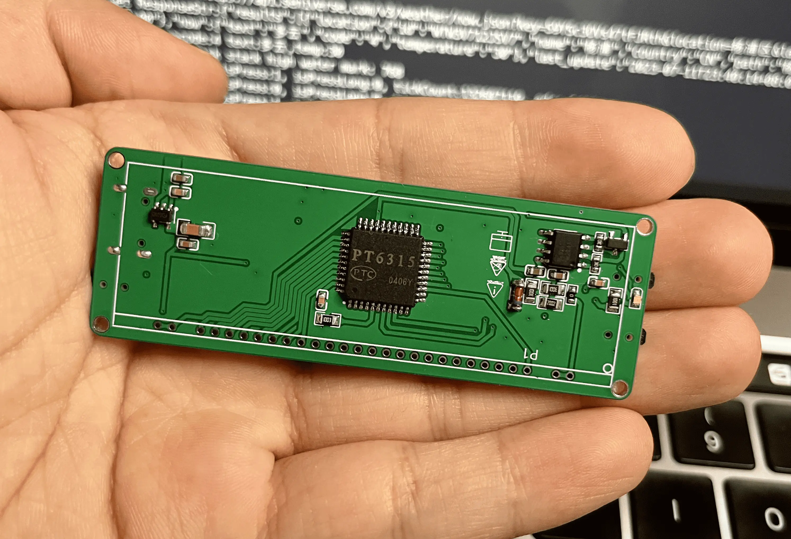

# ESP-VFD-PT6315
PT6315驱动8位米字玻璃VFD

> 志鑫家的VFD10元屏无资料，本期文章将介绍如何如何驱动点亮这款VFD屏幕，然后我们在画一张PCB将其制作成WIFI桌面时钟

这款VFD具有8位 米字段显示，价格便宜仅仅10元需要的朋友可以自行去下单购买。
到手其实尺寸并不大，还是比较小巧的。点亮后的颜色是蓝色，亮度很可观比LED要对比度高可视度任意角度都清晰，这也是VFD的优势吧。唯一的就是相对很耗电。

#### 个人博客Blog：http://www.saisaiwa.com

### 引脚定义
引脚数量： 28

灯丝驱动电压： 3Vac~3.8Vac 可以调试不发红即可，推荐使用交流驱动。

栅极阳极电压：推荐 30Vp-p

截止偏置电压：推荐 6.8Vdc

项目doc文件夹下有**VFD定义.xlsl**文件

### 实现的功能

1. WIFI配网 采用AP-Web模式使用WifiMamge库
2. 自定义字库
3. 时钟显示
4. 按键控制切换Page显示内容
   1. 年月日 yyyy MM dd
   2. 时分 HH:mm
   3. 时分秒 HH:mm:ss
5. 长按按键清空WIFI连接信息配置

---

本着小巧轻便的原则，驱动方案采用无变压器设计。

驱动芯片将采用专业VFD驱动IC选型：PT6315

电路图和选型介绍请看博客文章：
http://www.saisaiwa.com/archives/vfd-8m

|        |                             |
| -------------------------------- | ----------------------------------------------------------- |
|  |  |

